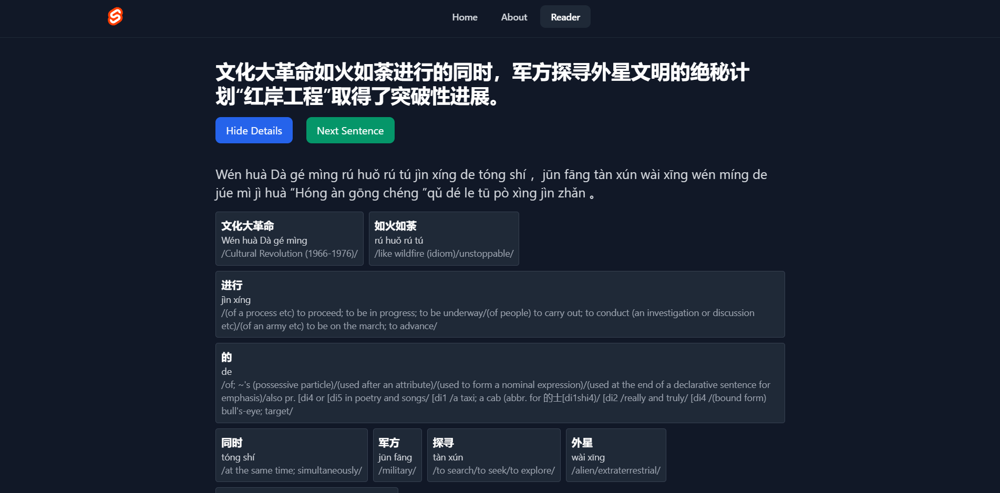

## Description
A personalized language-learning app designed to help you read and understand chinese books. The app processes the book sentence by sentence, allowing you to translate each sentence, view the correct translation, and learn new vocabulary in context.  
Later, connection to some cards app like anki would be done, so that when adding new words to the "review bucket", you can learn them separately.
